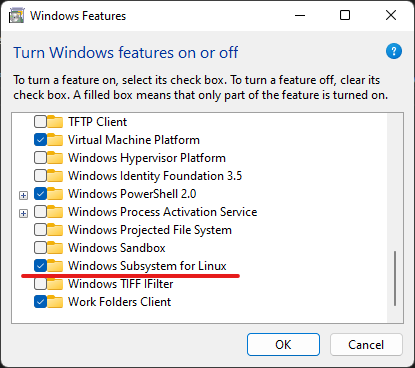
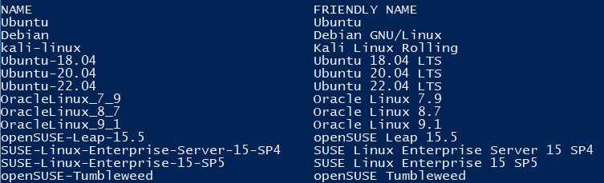
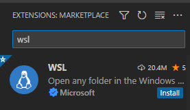
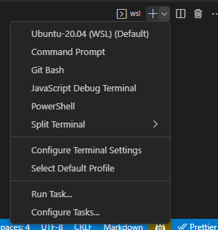

# Installing Windows Subsystem for Linux (WSL) on Windows 11

This will walk through the process of installing WSL on your Windows 11 Capgemini Laptop.
WSL allows you to run a Linux distribution alongside Windows, enabling Linux tools and utils directly.

## Prerequisites

Before attempting to install WSL, you will first need to put in two software elevation requests:

- Attempt to run **Windows Powershell** as an administrator and put in a request for elevated access.
- Open up the **Turn Windows features on or off** window, which will require a request as well.

<br>

---
## Installation Steps

Once your elevation requests have been approved, do the following:

### Enabling Windows Subsystem for Linux

<br>

Open the **Turn Windows features on or off** window, and scroll down until you see **Windows Subsystem for Linux** and check that box.

> Also check **Virtual Machine Platform** if it isn't checked already.



> You will be prompted to restart your machine, restart it.

<br>

### Installing WSL and a Linux Distribution

1. Now you'll need to launch **Windows Powershell** as an administrator.
2. Run the following command:

<br>

```
wsl --install --web-download
```
> The command will download and install the necessary components for WSL. After installation you will be prompted to restart again. 

<br>

3. Now you can proceed to installing a Linux distribution. Run **Windows Powershell** as an administrator again. Run the following command and you should see available Linux distributions:
```
wsl --list --online
```


4. In this case we will be installing Ubuntu-20.04 LTS with the following command:
```
wsl --install -d Ubuntu-20.04
```
5. After the installation is complete, we can launch the installed distribution with this command: 
```
wsl --distribution Ubuntu-20.04
```

<br>

---

## Setting up WSL for use in Visual Studio Code's Integrated Terminal

Once WSL is installed, upon launching Visual Studio Code you should be prompted to install the WSL extension.
If it doesn't appear on its own, you can navigate to the Extensions Marketplace and install the WSL extension:



Now you should be able to open up an Ubuntu Terminal when looking at your list of options within VSCode:



You also have the option to set it as a default terminal if you hit `Ctrl+P` and then type in `>Terminal: Select Default Profile`

<br>

---

## Setting up NPM in your newly installed Linux distro

Once you launch your new Linux distro for the first time, you'll be prompted to create a username and password, keep track of your password as you'll need it to run any `sudo` commands. 

1. First you will need to update your package manager by running the following command in your wsl terminal:
```
sudo apt update
```
2. Next we'll install Node Version Manager or NVM. This will allow us to quickly switch between versions of node and npm, which is useful for development as different repos within a project might have different requirements. Run the following:

```
curl -o- https://raw.githubusercontent.com/nvm-sh/nvm/v0.39.1/install.sh | bash
```

3. After running the installation script, close and reopen your WSL terminal. Then run the following to verify that nvm is installed correctly:
```
command -v nvm
```
If it was installed correctly then it should output `nvm`.

4. Now you can install the desired version of Node.js using nvm. In this case we need any version of **Node.js >= 16.14.2 < 17**, so we'll go with that exact version:

```
nvm install 16.14.2
```
You can install other versions by specifying the version and switch between them at any time with `nvm use {version}`, but for now we'll stick to **16.14.2**.

5. Verify that the correct versions are installed by running the following:

```
node --version
npm --version
```

These should output `v16.14.2`  and `8.5.0` respectively.